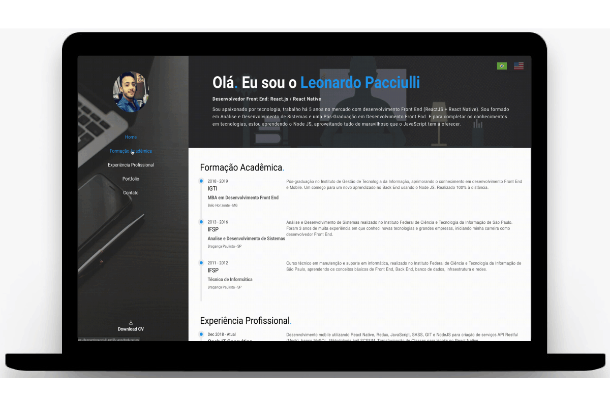

<h3 align="center">
  The project is my personal website to share my info's with you
</h3>

<p align="center">
  
  
  

  
  
  

  
</p>

<br>

### 📝 About the project
An application where the objective is to show my personal projects, my experiences working as a Front-end Developer, my academic training and share with you my contact.

<div align="center">
  
</div>

<br>

## 🖥 Front-End
The Front-End was developed with React.JS. I use i18n to internationalize the project and can be translated between portuguese and english language. The navigation screens were made with React Router DOM.

### 🛠 Technologies
- **[React.JS](https://reactjs.org/)**
- *[React Router DOM](https://reacttraining.com/react-router/web/guides/quick-start)*

<br>

🖥 To run the **Front-End**, in a terminal, execute the following commands:

````zsh
# to enter the project folder
$ cd leopacciulli.github.io

# to download the dependencies
$ yarn

# to start the application on port 3000
$ yarn start
````

---

<h3 align="center">
  Made with love by 💙 Leonardo Pacciulli
</h3>

<p align="center">
  <a href="https://www.linkedin.com/in/leonardo-pacciulli">
    
  </a>
  <a href="https://www.facebook.com/paculli">
    
  </a>
  <a href="https://www.instagram.com/leopacciulli/">
    
  </a>
</p>